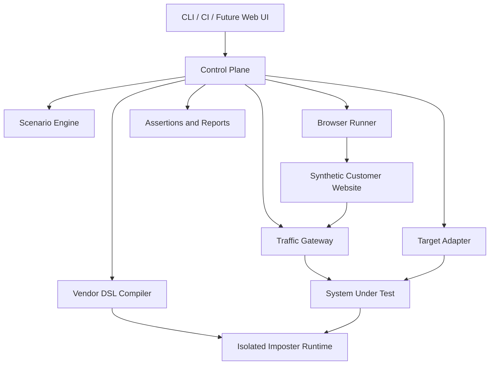

# Standalone Testing Platform

> **Product and System Plan v0.3 — 16 July 2026**

Updated system understanding, product boundary, declarative vendor simulation model, browser automation authoring model, and delivery plan.

| Field | Value |
|---|---|
| Status | Draft for architecture and scope approval |
| System model | Independent black-box testing platform |
| Vendor runtime | Imposter behind a platform-owned declarative DSL |
| Browser runtime | Playwright behind a platform-owned journey DSL |
| Requirement source | GL-EYE-024.1 kickoff checklist and planning discussion |

## 1. Executive summary

The Standalone Testing Platform is a separate greenfield product and repository. It tests GL-EYE and future compatible systems from the outside using synthetic customer websites, browser journeys, direct HTTP traffic, configurable provider endpoints, and approved test-environment APIs.

The platform has no dependency on the main application's language, database, queue implementation, or source repository. The main application is treated as a system under test and is accessed only through supported external interfaces.

The platform uses Imposter as its initial HTTP simulation runtime. Authors do not normally write native Imposter mappings. Instead, a versioned vendor-oriented YAML model describes vendor configuration, authentication, system-wide states, API behavior, payloads, faults, and response sequences. A compiler converts those descriptions into an isolated Imposter runtime for each active test run.

Browser automation follows the same principle. Mock customers, websites, pages, personas, and Playwright journeys are declared in YAML. A generic Playwright runner interprets those files. Normal customer journeys do not require Playwright code.

> **Core product promise:** A supported vendor, endpoint, response case, mock customer, browser journey, or test scenario can be added through configuration alone. Platform code changes are reserved for genuinely new runtime primitives.

## 2. Problem and desired outcome

The team needs a trustworthy way to exercise company identification, enrichment, privacy controls, consent handling, retries, idempotency, tenant isolation, and failure behavior before real customer traffic or representative corporate datasets are available.

The platform should enable developers and QA to:

- Run deterministic corporate visitor journeys locally and in CI.
- Simulate IPinfo, Apollo, Hunter, and future vendors without production credentials or external network calls.
- Model provider authentication, request validation, response selection, faults, quotas, and recovery declaratively.
- Add mock customer websites and browser journeys without writing Playwright code.
- Observe the system under test through public or approved test-environment interfaces.
- Produce a sanitized timeline, assertions, artifacts, and a reproducible report for every run.
- Use only synthetic, privacy-safe, version-controlled fixtures.

## 3. System boundary

The platform may interact with the system under test through:

- Browser-accessible customer websites and dashboards.
- Public tracking and ingestion endpoints.
- Configurable vendor base URLs.
- Webhooks and approved test-environment APIs.
- Trusted test-proxy configuration for synthetic source-IP attribution.
- Test-environment authentication and resource-provisioning interfaces.

The platform must not:

- Import the main application's code.
- Read or write its database directly.
- Read queue storage directly.
- Depend on internal class names or framework features.
- Require live vendor credentials.
- Replay real customer traffic in the default suite.



## 4. Users

| User | Primary use |
|---|---|
| Application engineer | Run deterministic scenarios while implementing identification, enrichment, retry, and privacy behavior. |
| QA engineer | Author mock customer journeys and scenario combinations, run suites, and inspect timelines. |
| Platform maintainer | Define DSL schemas, shared primitives, vendor packages, isolation, and runtime policies. |
| Product/Engineering manager | Approve readiness, scenario coverage, privacy rules, and release gates. |
| CI system | Execute selected suites and publish machine-readable results and artifacts. |

## 5. Complete system capabilities

### 5.1 Control Plane and Scenario Engine

- Validate scenarios, customer packages, vendor packages, and fixtures.
- Allocate run identifiers, synthetic IPs, hostnames, browser identities, and runtime state.
- Start and stop Imposter runtimes, browser workers, traffic generation, observation, and cleanup.
- Support ordered, parallel, repeated, conditional, and eventual steps with explicit timeouts.

### 5.2 Synthetic Customer Websites

- Host deterministic customer sites with stable selectors, forms, consent states, and tracking configuration.
- Use run-specific hostnames to isolate concurrent runs.
- Prioritize deterministic behavior over production visual fidelity.

### 5.3 Browser and Traffic Simulation

- Execute real browser journeys using Playwright.
- Simulate cookies, local storage, consent, navigation, forms, multiple tabs, returning visitors, and concurrent visitors.
- Generate direct HTTP traffic for duplicate, malformed, concurrent, and high-volume scenarios.
- Capture screenshots, traces, console errors, failed requests, and selected HAR data.

### 5.4 Traffic Gateway

- Route run-specific traffic to the configured target.
- Apply reserved documentation-range source IPs through a trusted test proxy.
- Remove visitor-supplied forwarding headers.
- Record only privacy-safe request metadata.
- Block unexpected external destinations.

### 5.5 Declarative Vendor Simulation Engine

- Compile a platform-owned vendor YAML DSL into Imposter configuration.
- Support authentication, request matching, system states, endpoint cases, response templates, faults, delays, quotas, and sequences.
- Maintain an isolated provider call ledger for assertions.

### 5.6 Target Adapter

- Encapsulate GL-EYE-specific provisioning, authentication, observation, and cleanup.
- Use only approved external or test-environment interfaces.
- Keep the platform core reusable for other systems under test.

### 5.7 Assertions and Reporting

- Assert provider calls, retries, visible outcomes, tenant isolation, idempotency, privacy, and network behavior.
- Produce JSON for CI and HTML for human investigation.
- Correlate browser actions, gateway events, provider calls, target observations, and assertion outcomes.

## 6. Declarative vendor model

Each vendor is stored as a configuration package:

```text
vendors/ipinfo/
├── vendor.yaml
├── system-cases.yaml
├── apis/
│   ├── ip-lookup.yaml
│   └── usage.yaml
├── responses/
├── openapi/
└── README.md
```

### 6.1 Vendor configuration

`vendor.yaml` describes stable vendor concerns:

- Vendor identity and version.
- Base paths and common headers.
- Authentication methods and synthetic credentials.
- Authentication failure responses.
- Default content type and unmatched-route behavior.
- Capture and redaction policies.
- Optional OpenAPI contracts.

### 6.2 System-level cases

`system-cases.yaml` describes behavior affecting the full vendor:

- Healthy, degraded, unavailable, and maintenance states.
- Global delay and transport faults.
- Shared quotas and rate limits.
- Authentication subsystem failure.
- Recovery after time, request count, or explicit transition.

### 6.3 API-level cases

Files under `apis/` describe endpoint-specific behavior:

- Method, path, query, header, and body matching.
- Request validation and invalid-input behavior.
- Status, headers, body, content type, and delay.
- Ordered response sequences.
- State transitions and call counters.

### 6.4 Scenario selection

A scenario selects vendor states, cases, fixtures, and sequences. It references the vendor contract rather than duplicating it.

## 7. Browser automation authoring model

Each mock customer is represented by a declarative package:

```text
customers/customer-alpha/
├── customer.yaml
├── sites/
│   └── main-site.yaml
├── pages/
│   ├── common.yaml
│   ├── homepage.yaml
│   ├── pricing.yaml
│   └── contact.yaml
├── personas/
│   ├── corporate-visitor.yaml
│   └── returning-visitor.yaml
└── journeys/
    ├── pricing-interest.yaml
    ├── contact-submission.yaml
    └── consent-rejected.yaml
```

### 7.1 Customer and site definitions

Customer files define synthetic tenant identity and available websites. Site files define hostname templates, paths, tracking configuration, consent behavior, and runtime variables such as the target tracking-script URL and site identifier.

### 7.2 Page definitions

Page files map semantic element names to stable selectors. Journeys reference names such as `pricing.contactSales`, not raw CSS selectors.

Stable `data-test` selectors are preferred. Controlled role, label, and text fallbacks may be supported where necessary.

### 7.3 Personas

Personas describe browser and network identity:

- Browser engine, locale, timezone, and viewport.
- Synthetic network fixture.
- Initial cookies and local storage.
- Consent state.
- New or returning visitor behavior.

### 7.4 Journeys

Journey YAML defines reusable Playwright actions and browser-level assertions. Initial actions include:

- `open`, `navigate`, `click`, `hover`, `fill`, `fillForm`, `select`, `check`, and `submit`.
- `reload`, `goBack`, `goForward`, `wait`, `waitForRequest`, `waitForResponse`, and `waitForEvent`.
- `expectVisible`, `expectHidden`, `expectText`, `expectUrl`, `expectAttribute`, and `expectRequest`.
- Cookie, local-storage, tab, session, screenshot, and trace actions.
- Controlled conditions, repetition, and reusable fragments.

Journey files may use deterministic run-scoped variables, for example a synthetic email containing the run identifier.

### 7.5 Reuse and parallel visitors

Common journey fragments can be included with parameters. A complete scenario can launch multiple journeys in parallel, each with an isolated Playwright browser context and synthetic IP assignment.

### 7.6 Assertion boundary

Journey files contain browser-level assertions, such as page visibility, form completion, consent behavior, and request emission.

Business assertions remain in the complete test scenario, such as company visibility, tenant isolation, provider call count, score creation, suppression, and idempotency.

### 7.7 No-code boundary

A new mock customer, site, page, persona, or journey using existing actions requires configuration only. Arbitrary JavaScript inside journey files is not allowed in the MVP. New shared actions require reviewed platform changes.

## 8. End-to-end operating model

1. Validate scenario, vendor packages, customer packages, and synthetic-data policies.
2. Create a run and allocate synthetic IPs, hostnames, and browser identities.
3. Compile selected vendor behavior into an Imposter bundle.
4. Start one isolated Imposter runtime and seed its state.
5. Configure the Traffic Gateway and prepare the target through its adapter.
6. Start synthetic sites and run browser journeys or direct traffic.
7. Observe provider calls, retries, callbacks, APIs, and user-visible outcomes.
8. Evaluate browser, business, privacy, and network assertions.
9. Generate JSON and HTML reports with browser and provider artifacts.
10. Remove runtime state, routes, browser state, and temporary target resources.

## 9. MVP scope

### Included

- Control Plane API and CLI.
- YAML scenarios with versioned JSON Schemas.
- Vendor DSL compiler for Imposter.
- One isolated Imposter runtime per active run.
- Initial IPinfo, Apollo, and Hunter packages.
- Declarative customer, site, page, persona, and journey packages.
- Playwright browser worker and direct HTTP generator.
- Traffic Gateway using reserved synthetic IPs.
- GL-EYE target adapter.
- Assertion engine, JSON reports, and HTML reports.
- Docker Compose and CI execution.
- Synthetic-data validation, secret scanning, and egress controls.

### Deferred

- Visual scenario editor.
- Multi-region execution.
- Shared high-density Imposter runtime pool.
- Production-scale load testing.
- Real customer traffic replay.
- Arbitrary customer-authored Playwright code.
- Direct database assertions.
- Kubernetes deployment.

## 10. Non-functional requirements

| Area | Requirement |
|---|---|
| Determinism | Version scenarios, fixtures, schemas, compiler output, browser versions, and runtime image references. |
| Isolation | Scope runtime stores, response counters, gateway routes, browser state, synthetic IPs, and artifacts by run. |
| Security | Deny unexpected egress, protect internal APIs, and strip spoofed proxy headers. |
| Privacy | Permit reserved IP ranges and approved synthetic domains only; redact secrets and contacts. |
| Usability | A clean local setup should require Docker/Compose and test-only configuration. |
| Debuggability | Reports include a sanitized timeline, matched cases, attempts, and browser artifacts. |
| Replaceability | Keep Imposter and Playwright behind internal platform abstractions. |
| Performance | MVP targets functional correctness and moderate parallelism. |

## 11. Delivery roadmap

| Phase | Outcome |
|---|---|
| 0 — Technical spike | Validate Imposter authentication, matching, stores, faults, sequences, call capture, and Docker/CI operation. |
| 1 — Vendor DSL foundation | Schemas, intermediate model, compiler, safety validation, and runtime lifecycle. |
| 2 — First vendor package | IPinfo corporate, residential, VPN/proxy, hosting, unknown, conflicting, and failure cases. |
| 3 — Enrichment vendors | Apollo and Hunter result, suppression, conflict, quota, and recovery behavior. |
| 4 — Browser DSL foundation | Customer, site, page, persona, journey, fragment, and Playwright-runner support. |
| 5 — Complete vertical slice | Synthetic customer journey, gateway, target adapter, enrichment, and tenant-isolation assertions. |
| 6 — Readiness gate | CI suites, reports, privacy scans, network controls, documentation, and ownership approval. |

## 12. Risks and mitigations

| Risk | Mitigation |
|---|---|
| Imposter feature mismatch | Complete a spike and keep the vendor execution model runtime-neutral. |
| Definitions become scripts | Require configuration-first solutions and review every escape hatch. |
| Parallel state leakage | Use one isolated runtime per active run and isolated browser contexts. |
| Test proxy creates spoofing risk | Enable it only in isolated test environments and strip inbound forwarding headers. |
| Target outcome is not observable | Define formal provisioning, status, observation, and cleanup interfaces. |
| Fixtures contain real data | Enforce schemas, allowlists, secret scans, and prohibited-data scans in CI. |
| Browser selectors become fragile | Require stable semantic selectors and page-object definitions. |
| License obligations are unclear | Pin an unmodified Imposter image and complete version-specific review before distribution. |

## 13. Acceptance criteria

- Docker Compose starts the platform and an isolated Imposter runtime without production credentials.
- A corporate visitor journey reaches identification, enrichment, and scoring without a live vendor call.
- New supported vendor cases can be added through YAML and payload files without platform code changes.
- A new mock customer journey can be added through customer, site, page, persona, and journey YAML without Playwright code.
- Authentication failures, invalid payloads, empty results, conflicts, suppression, rate limits, timeouts, transient failures, permanent failures, and recovery are deterministic.
- Residential, VPN/proxy, hosting, unknown, low-confidence, and conflicting attribution cannot be exposed unsafely.
- Retry limits, idempotency, and terminal-failure behavior are externally observable and assertable.
- Tenant isolation is verified through external interfaces.
- Reports contain no customer data, real raw IPs, plaintext secrets, or unapproved personal data.
- Unexpected external network calls fail the run.

## 14. Open decisions

| Decision | Provisional direction |
|---|---|
| Imposter version and image | Select during the spike and pin the image digest after feature and license review. |
| Target provisioning and observation | Define with the main application team before the first vertical slice. |
| Scenario syntax | YAML with JSON Schema; finalize composition and override semantics. |
| Browser selector convention | Prefer `data-test`; define controlled role and label fallbacks. |
| Browser DSL escape hatch | No arbitrary journey JavaScript in the MVP. |
| Maximum parallel runs | Measure after runtime startup and browser concurrency tests. |
| Artifact retention | Short retention by default with target-specific overrides. |
| Persistent work queue | Start with PostgreSQL state and add a queue only when required. |

## 15. References

- GL-EYE-024.1 — Complete the blocking kickoff checklist.
- [Imposter documentation](https://docs.imposter.sh/)
- [Imposter GitHub repository](https://github.com/imposter-project/imposter)
- [OpenAPI Specification](https://spec.openapis.org/oas/latest.html)
- [Playwright documentation](https://playwright.dev/docs/intro)
- [RFC 5737](https://www.rfc-editor.org/rfc/rfc5737.html)

> **License note:** The exact obligations depend on the selected Imposter implementation, version, image, modification, and distribution model. The chosen component must be reviewed and pinned before external distribution.