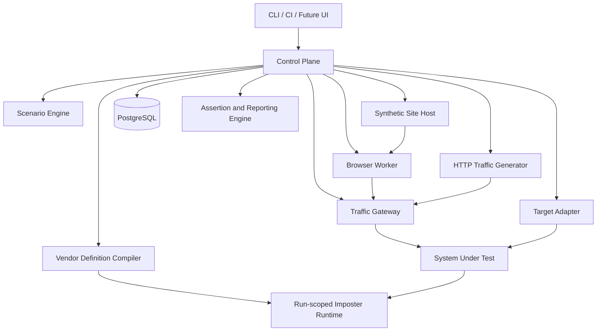
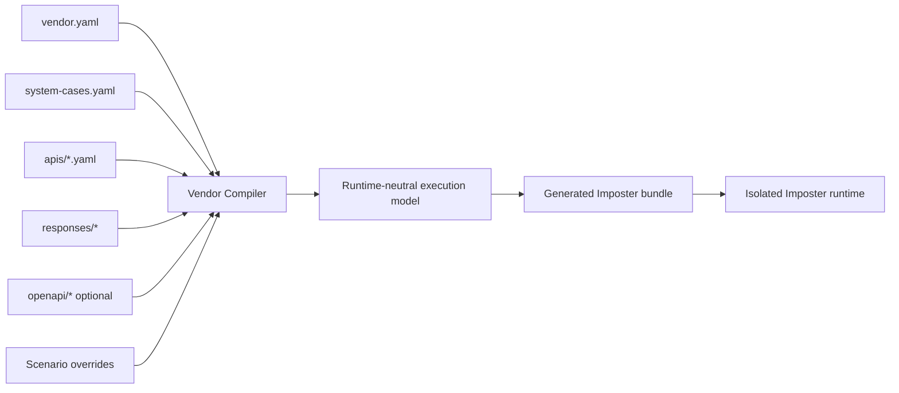

# Standalone Testing Platform

> **Technical Design v0.3 — Imposter-based Vendor and Browser Simulation**

| Field | Value |
|---|---|
| Status | Draft for architecture approval |
| Product model | Independent black-box testing platform |
| Vendor runtime | Imposter behind a platform-owned DSL |
| Browser runtime | Playwright behind a platform-owned journey DSL |
| Primary orchestration | Control Plane and Scenario Engine |

## 1. Architecture decisions

| Decision | Selection | Reason |
|---|---|---|
| Repository and deployment | Independent | Avoid coupling to the system under test. |
| Test style | Black-box by default | Validate real external contracts and observable outcomes. |
| Vendor runtime | Imposter | Reuse HTTP matching, templating, stores, faults, capture, and OpenAPI support. |
| Vendor authoring | Platform-owned YAML DSL | Describe complete vendors rather than low-level mock mappings. |
| Browser runtime | Playwright | Execute real browser behavior and tracking scripts. |
| Browser authoring | Customer/page/persona/journey YAML | Add normal journeys without Playwright code. |
| Vendor isolation | One Imposter runtime per active run in MVP | Prevent shared counters and state leakage. |
| Visitor IP simulation | Trusted test Traffic Gateway | Control source attribution without business-logic test branches. |
| Main-app specialization | Pluggable target adapter | Keep the platform core reusable. |
| State persistence | PostgreSQL | Durable orchestration, observations, ledgers, and reports. |

## 2. Logical architecture



### 2.1 Component responsibilities

| Component | Responsibility |
|---|---|
| Control Plane | Run lifecycle, allocation, compilation, orchestration, observation, assertion, and cleanup. |
| Scenario Engine | Declarative steps, composition, parallelism, repetition, polling, and timeouts. |
| Vendor Compiler | Validate vendor packages and generate run-scoped Imposter bundles. |
| Imposter Runtime | Execute provider HTTP behavior and maintain run-scoped state. |
| Synthetic Site Host | Serve deterministic mock customer websites. |
| Browser Worker | Interpret journey YAML through Playwright and capture artifacts. |
| Traffic Generator | Generate direct HTTP, duplicate, malformed, concurrency, and volume cases. |
| Traffic Gateway | Route test traffic, assign synthetic IPs, sanitize headers, and enforce destinations. |
| Target Adapter | Provision, configure, observe, authenticate, and clean up the target system. |
| Assertion/Reporting | Evaluate observations and produce JSON/HTML reports. |

## 3. Repository structure

```text
testing-platform/
├── apps/
│   ├── control-plane/
│   ├── browser-worker/
│   ├── vendor-runtime-manager/
│   ├── synthetic-site-host/
│   ├── traffic-gateway/
│   ├── traffic-generator/
│   └── cli/
├── packages/
│   ├── scenario-schema/
│   ├── scenario-engine/
│   ├── vendor-schema/
│   ├── vendor-compiler/
│   ├── browser-schema/
│   ├── browser-runner/
│   ├── assertion-engine/
│   ├── privacy-validation/
│   ├── reporting/
│   └── shared-types/
├── vendors/
│   ├── ipinfo/
│   ├── apollo/
│   └── hunter/
├── customers/
├── scenarios/
├── adapters/
│   └── gl-eye/
├── infrastructure/
│   ├── compose/
│   └── ci/
└── docs/
```

## 4. Vendor simulation architecture

Imposter is an execution engine, not the platform domain model. Authors use the platform DSL; the compiler creates Imposter configuration, response assets, stores, and minimal scripts.



### 4.1 Vendor package

```text
vendors/<vendor-id>/
├── vendor.yaml
├── system-cases.yaml
├── apis/
│   └── <operation>.yaml
├── responses/
├── openapi/
└── tests/
```

### 4.2 Vendor configuration

`vendor.yaml` defines identity, routing, authentication, defaults, and privacy-safe capture.

```yaml
schemaVersion: "1.0"
vendor:
  id: ipinfo
  displayName: IPinfo
  contractVersion: "2026-test"

server:
  basePath: /ipinfo
  defaultContentType: application/json

authentication:
  strategies:
    - id: bearer-token
      type: bearer
      source: header
      name: Authorization
      validValues:
        - "Bearer test-token-valid"
      onFailure:
        status: 401
        body: responses/unauthorized.json

routing:
  unmatchedRequest:
    status: 404
    body: responses/not-found.json

privacy:
  capture:
    allow: [method, path, selectedHeaders, bodyFingerprint]
    redactHeaders: [Authorization, Cookie, Set-Cookie]
```

### 4.3 System-level cases

```yaml
schemaVersion: "1.0"
initialState: healthy

states:
  healthy: {}

  degraded:
    defaults:
      delay: 2500ms

  unavailable:
    override:
      status: 503
      body: responses/unavailable.json

  quota-exhausted:
    override:
      status: 429
      headers:
        Retry-After: "30"
      body: responses/rate-limited.json

transitions:
  - from: unavailable
    to: healthy
    when:
      requestCountAtLeast: 3
```

### 4.4 API-level cases

```yaml
schemaVersion: "1.0"
operationId: lookup-ip
request:
  method: GET
  path: /{ip}

cases:
  - id: corporate-high-confidence
    priority: 100
    when:
      path.ip: "198.51.100.10"
    respond:
      status: 200
      body: responses/corporate.json

  - id: residential
    priority: 100
    when:
      path.ip: "198.51.100.20"
    respond:
      status: 200
      body: responses/residential.json

  - id: invalid-ip
    priority: 50
    when:
      path.ip:
        doesNotMatch: reserved-ip-pattern
    respond:
      status: 400
      body: responses/invalid-ip.json
```

### 4.5 Scenario response sequences

```yaml
schemaVersion: "1.0"
id: ipinfo-timeout-then-recovery

vendors:
  ipinfo:
    initialSystemState: healthy
    operations:
      lookup-ip:
        match:
          path.ip: "198.51.100.61"
        sequence:
          - transport:
              type: timeout
              duration: 5s
          - response:
              status: 503
              body: responses/unavailable.json
          - useCase: corporate-high-confidence
```

### 4.6 Initial vendor primitives

Matching operators:

- Scalar: `equals`, `notEquals`, `in`, `present`, `absent`.
- String: `matchesRegex`, `startsWith`, `endsWith`, `contains`.
- Numeric: comparisons and ranges.
- Locations: path, query, header, cookie, JSON body, and form body.
- State: attempt number, previous case, counters, and stored values.
- Composition: `all`, `any`, and `none`.

Response and fault primitives:

- Status, headers, content type, inline/file/template body.
- Fixed delay and deterministic bounded delay.
- Timeout and supported connection-close/reset faults.
- Ordered sequences with repeat-last or terminal behavior.
- State transitions, counters, and store mutations.
- DSL or OpenAPI request validation.

### 4.7 Compilation pipeline

1. Load vendor package and scenario selection.
2. Validate YAML against versioned JSON Schemas.
3. Resolve references, fragments, and response assets.
4. Apply privacy and synthetic-data validation.
5. Build a typed runtime-neutral Vendor Execution Model.
6. Apply run namespaces, synthetic credentials, and overrides.
7. Compile into Imposter configuration and assets.
8. Produce content hashes and a source map from generated rules to DSL cases.
9. Start the runtime and verify readiness.
10. Seed stores and expose run-specific provider base URLs.

Generated bundle:

```text
generated/run_<id>/vendors/
├── manifest.json
├── imposter/
│   ├── vendor-config.yaml
│   ├── generated-steps.js
│   ├── responses/
│   └── seeded-store.json
└── source-map.json
```

Generated scripts are permitted only when native configuration cannot represent an approved DSL primitive.

## 5. Browser automation architecture

Browser automation is configuration-driven. The Playwright runner contains implementation code; mock customer packages contain only declarative definitions.

### 5.1 Customer package

```text
customers/customer-alpha/
├── customer.yaml
├── sites/
│   └── main-site.yaml
├── pages/
│   ├── common.yaml
│   ├── homepage.yaml
│   ├── pricing.yaml
│   └── contact.yaml
├── personas/
│   ├── corporate-visitor.yaml
│   └── returning-visitor.yaml
└── journeys/
    ├── pricing-interest.yaml
    ├── contact-submission.yaml
    └── consent-rejected.yaml
```

### 5.2 Customer definition

```yaml
schemaVersion: "1.0"
customer:
  id: customer-alpha
  name: Customer Alpha
  tenantFixture: customer-alpha

sites:
  main:
    definition: sites/main-site.yaml
```

### 5.3 Site definition

```yaml
schemaVersion: "1.0"
site:
  id: customer-alpha-main
  hostname: customer-alpha.sim.test
  startPath: /

tracking:
  scriptUrl: "${target.trackingScriptUrl}"
  siteId: "${target.siteId}"

pages:
  home: /
  pricing: /pricing
  product: /products/analytics
  contact: /contact
```

The Control Plane resolves target and run variables before launching the site.

### 5.4 Page definition

```yaml
schemaVersion: "1.0"
page:
  id: pricing
  path: /pricing

elements:
  heading:
    selector: '[data-test="pricing-heading"]'
  enterprisePlan:
    selector: '[data-test="enterprise-plan"]'
  contactSales:
    selector: '[data-test="contact-sales"]'
```

Journeys reference semantic targets such as `pricing.contactSales`. Raw selectors are confined to page definitions.

Selector priority:

1. Stable `data-test` attribute.
2. Accessible role and name.
3. Label or placeholder.
4. Controlled CSS fallback.

Positional selectors such as `nth-child` should be rejected unless explicitly approved.

### 5.5 Persona definition

```yaml
schemaVersion: "1.0"
persona:
  id: corporate-visitor

browser:
  engine: chromium
  locale: en-GB
  timezone: Europe/Berlin
  viewport:
    width: 1440
    height: 900

network:
  fixture: corporate-high-confidence

session:
  cookies: []
  localStorage: {}

consent:
  initialState: unknown
```

A returning persona can restore a previously saved browser state:

```yaml
persona:
  id: returning-corporate-visitor
extends: corporate-visitor
session:
  restoreFrom: "${previousRun.visitorSession}"
```

### 5.6 Journey definition

```yaml
schemaVersion: "1.0"
journey:
  id: corporate-pricing-interest
  customer: customer-alpha
  site: main
  persona: corporate-visitor

settings:
  timeout: 60s
  actionTimeout: 10s
  captureTrace: on-failure
  captureScreenshots: on-failure

variables:
  visitorEmail: "visitor-${run.id}@nordlicht-example.test"

steps:
  - id: open-homepage
    action: open
    page: home

  - id: accept-consent
    action: click
    target: common.consentAccept
    when:
      visible: common.consentBanner

  - id: open-pricing
    action: click
    target: home.pricingLink

  - id: verify-plan
    action: expectVisible
    target: pricing.enterprisePlan

  - id: contact-sales
    action: click
    target: pricing.contactSales

  - id: complete-form
    action: fillForm
    target: contact.salesForm
    values:
      firstName: Anna
      lastName: Example
      company: Nordlicht Example GmbH
      email: "${variables.visitorEmail}"

  - id: submit-form
    action: click
    target: contact.submit

  - id: verify-submission
    action: expectVisible
    target: contact.successMessage
```

### 5.7 Initial browser actions

Navigation and interaction:

- `open`, `navigate`, `click`, `doubleClick`, `hover`, `fill`, `fillForm`, `select`, `check`, `uncheck`, `submit`, and synthetic file upload.

Waiting and network:

- `wait`, `waitForRequest`, `waitForResponse`, `waitForEvent`, and `reload`.

Assertions:

- `expectVisible`, `expectHidden`, `expectText`, `expectUrl`, `expectAttribute`, and `expectRequest`.

State and tabs:

- `setCookie`, `clearCookies`, `setLocalStorage`, `openNewTab`, `switchTab`, `closeTab`, `saveSession`, and `restoreSession`.

Artifacts:

- `screenshot`, trace capture, console capture, failed-request capture, and selected HAR capture.

### 5.8 Conditions, repetition, and fragments

Conditions use predefined operators and cannot execute arbitrary JavaScript.

```yaml
- action: click
  target: common.consentAccept
  when:
    visible: common.consentBanner
```

Repeated actions:

```yaml
- action: repeat
  times: 3
  steps:
    - action: reload
    - action: wait
      duration: 500ms
```

Reusable fragments:

```text
journey-fragments/
├── accept-consent.yaml
├── reject-consent.yaml
├── browse-three-pages.yaml
└── submit-contact-form.yaml
```

```yaml
steps:
  - use: fragments/accept-consent
  - use: fragments/browse-three-pages
    with:
      pages: [home, pricing, product]
```

### 5.9 Parallel visitors

```yaml
browserJourneys:
  - id: corporate-visitor
    use: customers/customer-alpha/journeys/pricing-interest.yaml
    persona: corporate-visitor
  - id: residential-visitor
    use: customers/customer-alpha/journeys/homepage-visit.yaml
    persona: residential-visitor

execution:
  mode: parallel
```

Each journey receives an isolated browser context, storage state, synthetic network fixture, and artifact namespace.

### 5.10 Assertion boundary

Browser journey files assert only browser-observable behavior:

- Page or element visibility.
- Form completion.
- Consent changes.
- Request emission.
- Navigation outcome.
- Browser console and network errors.

Business and provider assertions belong to the full test scenario:

- Company visibility.
- Tenant isolation.
- Provider call count and order.
- Retry and recovery behavior.
- Score creation.
- Suppression and privacy.
- Idempotency.

### 5.11 No-code boundary

Adding a customer, site, page, persona, fragment, or journey using supported primitives requires no Playwright code. Arbitrary JavaScript in journey YAML is prohibited in the MVP. New actions or selector strategies require schema, runner, documentation, and contract-test changes.

## 6. Complete scenario model

A scenario combines target resources, browser journeys, vendor behavior, observation, and business assertions.

```yaml
schemaVersion: "1.0"
id: corporate-visitor-enriched

target:
  adapter: gl-eye
  environment: local

resources:
  tenant: customer-alpha
  controlTenant: customer-beta
  site: customer-alpha-main

browser:
  journeys:
    - use: customers/customer-alpha/journeys/pricing-interest.yaml
      persona: corporate-visitor

vendors:
  ipinfo:
    systemState: healthy
    operationCases:
      lookup-ip: corporate-high-confidence
  apollo:
    operationCases:
      company-enrichment: company-partial
  hunter:
    operationCases:
      domain-search: contact-complete

observations:
  timeout: 60s
  pollInterval: 2s

assertions:
  - type: browserJourneyPassed
    journey: corporate-pricing-interest
  - type: providerCallCount
    provider: ipinfo
    equals: 1
  - type: companyVisible
    tenant: customer-alpha
    company: nordlicht-example
  - type: companyNotVisible
    tenant: customer-beta
    company: nordlicht-example
  - type: scoreCreatedCount
    company: nordlicht-example
    equals: 1
  - type: noUnexpectedExternalCalls
```

Scenarios can extend reusable fragments. The fully resolved scenario is materialized and hashed before execution.

## 7. Run lifecycle

```text
CREATED
  -> VALIDATING
  -> ALLOCATING
  -> COMPILING
  -> CONFIGURING
  -> RUNNING
  -> OBSERVING
  -> ASSERTING
  -> PASSED | FAILED

Any active state may transition through CANCELLING to CANCELLED.
Cleanup runs after every terminal state.
```

Execution sequence:

1. Validate scenario, vendor packages, customer packages, and privacy rules.
2. Allocate run ID, synthetic IPs, hostnames, browser identities, and runtime namespace.
3. Compile and start the Imposter runtime.
4. Configure the gateway and target adapter.
5. Start observations and artifact capture.
6. Execute browser journeys and optional HTTP traffic.
7. Wait for target completion through approved interfaces.
8. Evaluate browser, provider, business, privacy, and network assertions.
9. Generate reports.
10. Clean target resources, runtime state, gateway routes, browser state, and leases.

Cleanup must be idempotent.

## 8. Runtime isolation

The MVP runs one Imposter container per active test run, with all selected vendors under separate paths.

```text
http://run-123.vendor.internal/ipinfo
http://run-123.vendor.internal/apollo
http://run-123.vendor.internal/hunter
```

Run isolation covers:

- Imposter process/container.
- Configuration bundle and filesystem namespace.
- Store keys and call counters.
- Synthetic credentials.
- Provider call ledger.
- Gateway hostname and synthetic IP leases.
- Browser contexts, sessions, and artifacts.
- Temporary target resources.

A shared runtime pool may be considered later without changing the authoring DSL.

## 9. Control Plane APIs

```http
POST /v1/runs
GET  /v1/runs/{runId}
POST /v1/runs/{runId}/cancel
GET  /v1/runs/{runId}/timeline
GET  /v1/runs/{runId}/report
GET  /v1/runs/{runId}/artifacts

GET  /v1/scenarios
GET  /v1/scenarios/{scenarioId}
POST /v1/scenarios/validate

GET  /v1/vendors
GET  /v1/vendors/{vendorId}
POST /v1/vendors/validate
POST /v1/vendors/compile-preview

GET  /v1/customers
GET  /v1/customers/{customerId}
POST /v1/customers/validate
POST /v1/journeys/validate

GET  /v1/health
GET  /v1/readiness
```

Internal runtime APIs are private-network only and service-authenticated.

## 10. Traffic Gateway

The gateway:

- Maps a run-specific hostname to the target ingestion endpoint.
- Removes visitor-provided `Forwarded`, `X-Forwarded-For`, and equivalent headers.
- Applies the run's synthetic address using the target's approved test-proxy convention.
- Strips internal correlation headers before forwarding where required.
- Records safe metadata and body fingerprints only.
- Rejects expired, unknown, or mismatched run routes.
- Enforces target allowlists and blocks real vendor destinations.

Synthetic visitor addresses are limited to documentation ranges:

- `192.0.2.0/24`
- `198.51.100.0/24`
- `203.0.113.0/24`

The target must trust the gateway only in isolated test environments.

## 11. Target adapter contract

Conceptual interface:

```typescript
interface TargetAdapter {
  prepareRun(context: RunContext): Promise<PreparedTarget>;
  configureVendorEndpoints(context: RunContext, endpoints: VendorEndpoints): Promise<void>;
  configureSyntheticSite(context: RunContext, site: SiteDefinition): Promise<SiteBinding>;
  startObservation(context: RunContext): Promise<ObservationHandle>;
  waitForCompletion(context: RunContext, condition: CompletionCondition): Promise<ObservationResult>;
  collectOutcome(context: RunContext): Promise<TargetOutcome>;
  cleanupRun(context: RunContext): Promise<void>;
}
```

Required target capabilities:

- Configurable IPinfo, Apollo, and Hunter base URLs.
- Trusted test-gateway configuration.
- Test tenant/site provisioning or stable dedicated fixtures.
- Test authentication.
- Externally observable processing completion.
- Externally observable resulting company state and tenant isolation.
- Cleanup of temporary resources.

Prohibited dependencies:

- Direct database queries.
- Application source imports.
- Queue-storage inspection.
- Undocumented internal APIs.

## 12. Persistence model

| Entity | Purpose |
|---|---|
| TestRun | Scenario, target, status, timestamps, versions, and failure summary. |
| RunStep | Orchestration and action attempts with sanitized outputs. |
| ResourceLease | Synthetic IP, hostname, browser, and runtime allocation. |
| RuntimeInstance | Imposter image, endpoint, bundle hash, and lifecycle. |
| ProviderCall | Provider, operation, case, attempt, status, timing, and safe fingerprint. |
| BrowserAction | Journey, step, result, timing, and artifact references. |
| Observation | Target, gateway, webhook, browser, and provider observations. |
| AssertionResult | Expected, actual, result, and diagnostic message. |
| Artifact | Trace, screenshot, report, hash, and retention metadata. |

Raw authorization values, cookies, full IP addresses, contact payloads, and form contents are not persisted in normal ledgers.

## 13. Assertions and reporting

Assertion categories:

- Browser: visibility, text, navigation, request emission, consent, and errors.
- Provider: call count, matched case, order, retry, recovery, and terminal failure.
- Tracking: expected events, duplicates, ordering, and malformed input behavior.
- Outcome: company identification, scoring, enrichment, suppression, and confidence policy.
- Isolation: visible to the expected tenant and hidden from control tenants.
- Privacy: no prohibited values in logs, captures, or artifacts.
- Network: no unexpected external destination.

Eventual assertions define timeout, poll interval, success predicate, and terminal-failure predicate.

Run outputs:

- Machine-readable JSON for CI.
- Human-readable HTML report.
- Sanitized correlated timeline.
- Source-linked vendor case and browser journey identifiers.
- Screenshots and Playwright traces according to retention policy.

## 14. Security and privacy

- Reject publicly routable fixture IPs.
- Allow only approved synthetic domains such as `.test`, `.example`, and `.invalid`.
- Reject known production hosts, customer identifiers, real credentials, and unapproved personal data.
- Deny outbound internet access during test execution except approved target hosts.
- Never proxy unknown provider requests to real vendors.
- Protect internal APIs through private networking, service identity, and run-scoped authorization.
- Redact authorization, cookies, raw contact data, full IPs, and form values.
- Apply short default artifact retention.
- Require review for new DSL primitives, generated scripts, and browser actions.

## 15. Local deployment and CI

Initial Docker Compose topology:

```text
control-plane
browser-worker
vendor-runtime-manager
synthetic-site-host
traffic-gateway
traffic-generator
postgres

# one ephemeral Imposter container per active run
```

CI levels:

1. Static validation: types, lint, schemas, synthetic data, and secrets.
2. Unit tests: parsers, intermediate models, compiler, browser action interpreter, assertions, and redaction.
3. Platform integration tests: generated Imposter behavior, browser journeys, gateway routing, isolation, and cleanup.
4. Target acceptance tests: selected complete scenarios against the actual test environment.

Reproducibility requirements:

- Pin Node, package manager, browser, and Imposter versions.
- Record image digests and content hashes in reports.
- Materialize composed scenarios before execution.
- Avoid uncontrolled randomness and real-time sleeps where a controlled clock can be used.

## 16. Platform self-testing

A small reference system under test will:

- Receive tracking events.
- Call the generated vendor simulation.
- Implement configurable retry behavior.
- Expose observable outcomes.
- Contain no GL-EYE business logic.

The platform's own tests include:

- Golden compiler tests.
- Runtime contract tests for every vendor primitive.
- Browser action contract tests for every journey action.
- Mutation tests proving assertions fail on broken behavior.
- Parallel-run isolation tests.
- Cleanup tests at every lifecycle stage.

## 17. MVP vertical slice

Scenario: a visitor from synthetic company Nordlicht Example GmbH accesses Customer Alpha's website. IPinfo identifies the company, Apollo returns partial enrichment, and Hunter supplies the missing synthetic contact. The result appears only for Customer Alpha and is scored once.

Required sequence:

1. Validate and resolve the scenario.
2. Compile IPinfo, Apollo, and Hunter packages.
3. Start an isolated Imposter runtime.
4. Lease the corporate synthetic IP and configure the gateway.
5. Prepare Customer Alpha and Customer Beta through the target adapter.
6. Run a three-page Playwright journey and submit an interaction.
7. Observe simulated provider calls and target completion.
8. Assert provider behavior, visibility, isolation, idempotency, privacy, and network safety.
9. Generate the report and clean every run resource.

Mandatory assertions:

- Browser journey passed.
- IPinfo called once with the expected synthetic lookup.
- Apollo and Hunter called according to enrichment policy.
- Expected company visible to Customer Alpha.
- Company not visible to Customer Beta.
- Score created exactly once.
- No unexpected outbound request occurred.
- No sensitive value was stored in ledgers or reports.
- All authored data passed synthetic-data validation.

## 18. Open technical decisions

| Question | Validation needed |
|---|---|
| Which Imposter implementation and image? | Feature spike and exact version/license review. |
| Which transport faults are reliable? | Runtime contract tests for timeout, close/reset, malformed body, and delay. |
| How are vendor URLs configured in the target? | Formal target-adapter integration contract. |
| How is processing completion observed? | Prefer status API or webhook; use UI polling when necessary. |
| How are synthetic tenants provisioned? | Compare ephemeral API-created resources with stable dedicated tenants. |
| What is the browser selector policy? | Finalize stable selector requirements and validation. |
| When is a new browser action justified? | Define review and compatibility policy. |
| How many parallel runs are required? | Estimate CI demand and benchmark browser/runtime startup. |
| What is the schema compatibility policy? | Define backward compatibility and migration tooling. |

## 19. References

- GL-EYE-024.1 — Complete the blocking kickoff checklist.
- [Imposter documentation](https://docs.imposter.sh/)
- [Imposter GitHub repository](https://github.com/imposter-project/imposter)
- [OpenAPI Specification](https://spec.openapis.org/oas/latest.html)
- [Playwright documentation](https://playwright.dev/docs/intro)
- [RFC 5737](https://www.rfc-editor.org/rfc/rfc5737.html)

> The selected Imposter component, version, image, modification model, and distribution approach must be pinned and reviewed before external distribution.